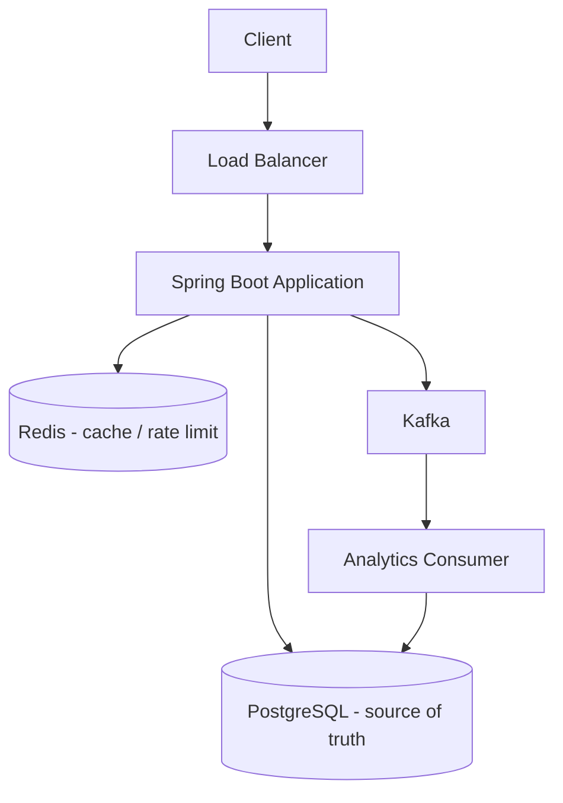
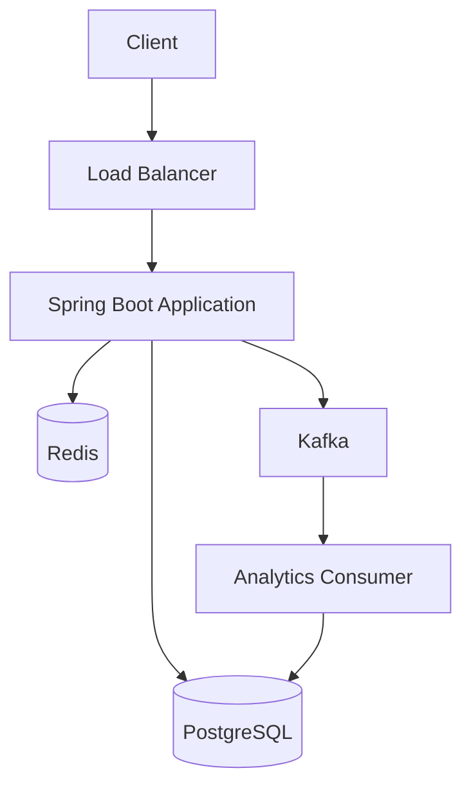

# Implementation Plan — URL Shortener

**Final Year Project** · Modular Monolith · Java/Spring Boot · PostgreSQL · Redis · Kafka
---
## 1. Project Overview
We build a URL Shortener. Users paste a long URL and get a short one:
- Long: `https://example.com/very/long/path?user=123`
- Short: `https://short.ly/aB72xK`

Opening the short URL redirects the user to the original long URL.

**Why it is useful:** long links are hard to share; a shortener makes them friendly and trackable.

**What it demonstrates:** system design, REST APIs, caching, async processing, database design, rate limiting, security, testing, and observability — all in one manageable project.

**Architecture style:** a **Modular Monolith** — one deployable with clean internal packages. We avoid microservices unless needed later.
---
## 2. Goals
- Fast redirects (cache-first, then database fallback)
- Unique, collision-free short codes
- Optional custom aliases and URL expiration
- Secure APIs (JWT authentication, input validation)
- Asynchronous click analytics via Kafka
- Reliable database storage (PostgreSQL)
- Rate limiting to prevent abuse
- Clean, testable, documented code
- Docker-based reproducible development environment
---
## 3. High-Level Architecture


**Components (1–2 sentences each):**
- **Load Balancer** — spreads requests across app instances; routes around unhealthy ones. (Single-node in dev; multiple in production.)
- **Spring Boot app** — serves all APIs: auth, URL creation/management, and redirects. Stateless, so it scales horizontally.
- **Redis** — holds the hot redirects (cache-aside) and rate-limit counters. Very fast reads.
- **PostgreSQL** — the source of truth for users, URLs, and analytics. Relational + indexed.
- **Kafka** — a message bus that decouples the redirect path from analytics. High throughput.
- **Analytics Consumer** — reads click events from Kafka, enriches them, and writes to PostgreSQL.
---
## 4. Main Request Flows
### 4.1 Create URL
```
User → POST /api/v1/urls → validate input → authenticate → generate short code
     → save URL to PostgreSQL → warm Redis cache → return short URL
```

Steps:
1. User sends the long URL (and optional custom alias / expiry).
2. We validate the URL and authenticate the user.
3. Generate a unique short code (see §7).
4. Insert the URL row into PostgreSQL.
5. Store it in Redis so the first redirect is fast.
6. Return the short URL `201`.
### 4.2 Redirect
```
User opens /{shortCode} → check Redis
   → HIT: read original URL → redirect (302)
   → MISS: query PostgreSQL → save to Redis → redirect (302)
   → not found at all → 404
```

1. Look up `url:{code}` in Redis.
2. Cache hit → redirect immediately.
3. Cache miss → query PostgreSQL on the indexed `short_code` column.
4. Populate Redis so the next request hits cache.
5. Redirect with `302 Found`. If expired → `410 Gone`; if missing → `404`.
### 4.3 Analytics
```
Redirect happens → publish click event → Kafka → Consumer → update analytics
```
- The redirect does **not** wait for analytics. It returns immediately.
- A lightweight click event is sent to Kafka (fire-and-forget, best effort).
- The consumer enriches (device, country) and updates counts in PostgreSQL.
- **Result:** analytics never slows down the redirect.
---
## 5. Technology Decisions
| Technology | Why we use it |
|------------|---------------|
| **Spring Boot** | Mature Java framework; fast setup, DI, web, security, JPA, all integrated. |
| **PostgreSQL** | Reliable relational DB with strong indexes — good for the `short_code` lookup and analytics. |
| **Redis** | Sub-millisecond cache for the hottest reads (redirects) + distributed rate limiting. |
| **Kafka** | Decouples analytics from the redirect path; handles a high volume of click events asynchronously. |
| **JWT** | Stateless authentication — no server session, scales horizontally naturally. |
| **Docker** | One-command reproducible dev environment (app + Postgres + Redis + Kafka). |
---
## 6. Database Design
### 6.1 Tables
**users**
| field | type | notes |
|-------|------|-------|
| id | bigint PK | internal |
| email | varchar(255) | unique, not null |
| password | varchar(255) | hashed |
| created_at | timestamptz | |

**urls**
| field | type | notes |
|-------|------|-------|
| id | bigint PK | internal |
| user_id | bigint FK | → users.id (nullable for anonymous) |
| short_code | varchar(12) | **unique, indexed** |
| original_url | text | not null |
| custom_alias | varchar(64) | unique, nullable |
| expires_at | timestamptz | nullable (null = never) |
| created_at | timestamptz | |

**click_events**
| field | type | notes |
|-------|------|-------|
| id | bigint PK | |
| url_id | bigint FK | → urls.id |
| short_code | varchar(12) | denormalized for queries |
| event_time | timestamptz | |
| referrer | varchar | nullable |
| user_agent | text | nullable |
| ip | inet | anonymized before saving |
| country | char(2) | added by consumer |
### 6.2 ER Diagram
```mermaid
erDiagram
    users ||--o{ urls : owns
    urls ||--o{ click_events : generates
    users { bigint id PK }
    urls { bigint id PK; varchar short_code UK; text original_url; varchar custom_alias; timestamptz expires_at }
    click_events { bigint id PK; bigint url_id FK; varchar short_code; timestamptz event_time }
```
### 6.3 Indexes
- `short_code` — **unique index**. This is the key used on every redirect that misses cache. An index makes lookup O(log n) even with millions of rows and also enforces uniqueness.
- `user_id` — to list a user's URLs efficiently.
- `url_id` — to fetch analytics for a URL.
---
## 7. Short Code Generation
**Compare briefly:**

| Approach | Pros | Cons |
|----------|------|------|
| Random Base62 | Unpredictable, no coordination, scales | tiny collision chance (handled by retry) |
| ID + Base62 (sequential) | no collisions | predictable → users can guess others' links; poorly scaled |

**Choice: Random Base62.**
- Base62 uses `a–z, A–Z, 0–9` — URL-safe, compact. With 7 characters we get `62^7 ≈ 3.5 trillion` codes.
- **Uniqueness:** a unique database constraint on `short_code` is the final guard.
- **Collisions:** extremely unlikely. If a duplicate is rejected by the database, we simply **regenerate a new code and retry** (a bounded number of times).

Core rule: the short code is stored per URL; the DB index guarantees uniqueness, and the retry handles the rare collision.
---
## 8. Redis Design
### What we store
- `url:{shortCode} → { originalUrl, expiresAt }` (JSON)
- `rate:{endpoint}:{key} → token bucket state`
### Cache-aside pattern
1. **Cache hit:** `GET url:{code}` returns the URL → redirect.
2. **Cache miss:** query PostgreSQL, then `SET` the result in Redis for next time.
3. **Population:** on URL creation we warm the cache; on miss we populate it.
### TTL
- Set a TTL (e.g. `min(expiresAt - now, 7 days)`; defaults to 7 days). This keeps stale data from living forever.
### Invalidation
- On URL delete or expiry, `DEL url:{code}` so the cache no longer redirects to old data.
- Short TTLs also naturally expire stale entries.
### Failure handling
- If Redis is down, we **catch the error and fall back to PostgreSQL**. The redirect must never fail because of a cache problem.
---
## 9. Kafka / Analytics Design
**Why Kafka:** analytics is a high-volume, low-priority task. Kafka lets the redirect path and analytics scale separately, and it buffers bursts of click events.

**Flow:**
```
Redirect → publish click event → Kafka topic "click_events" → Consumer → update PostgreSQL
```
- The redirect publishes an event with `{ shortCode, urlId, time, referrer, userAgent, ip, requestId }`.
- The **consumer** (a Spring Bean / separate module) reads batches, enriches (device, country), then:
  - inserts a `click_events` row, and
  - updates an aggregate (total clicks, device breakdown).
- Events are keyed by `shortCode` so ordering per URL is preserved.
- **Asynchronous means:** the user gets the redirect immediately; analytics appear a moment later and never slow the request.

Keep it simple: no complex fan-out or multi-topic design.
---
## 10. API Design
Base path `/api/v1`. The redirect is a public root endpoint.

| Method & Path | Purpose | Request | Response | Auth |
|---------------|---------|---------|----------|------|
| `POST /api/v1/auth/register` | create account | `{email, password}` | `201 {id, email}` | public |
| `POST /api/v1/auth/login` | get JWT | `{email, password}` | `200 {accessToken}` | public |
| `POST /api/v1/urls` | create short URL | `{originalUrl, customAlias?, expiresAt?}` | `201 {shortCode, shortUrl, ...}` | JWT |
| `GET /api/v1/urls` | list my URLs | `?page=&size=` | `200 {content, totalPages}` | JWT |
| `GET /api/v1/urls/{id}` | get one URL | — | `200 url` | JWT (owner) |
| `DELETE /api/v1/urls/{id}` | delete URL | — | `204` | JWT (owner) |
| `GET /api/v1/urls/{id}/analytics` | URL stats | — | `200 {totalClicks, ...}` | JWT (owner) |
| `GET /{shortCode}` | redirect | — | `302 Location` | public |

Rules:
- Pagination for list endpoints (page/size, max size 100).
- Owners can only read/delete their own URLs (else `403`; for listing, non-owners get `404` to avoid enumeration).
- Consistent status codes: `201`, `204`, `400`, `401`, `403`, `404`, `409`, `410`, `429`.
---
## 11. Authentication & Security
- **Password hashing:** store an Argon2id/BCrypt hash — never plaintext.
- **JWT:** after login, return a short-lived access token (e.g. 15 min). A filter checks the token on protected endpoints.
- **Authorization:** owners manage only their own URLs (owner check in the service layer).
- **Input validation:** use Bean Validation at the DTO boundary; reject bad URLs, empty fields, oversized payloads.
- **Rate limiting:** token-bucket via Redis on create/redirect/login (§12).
- **SQL injection:** use JPA/parameterized queries — no raw string concatenation.
- **Malicious URLs:** validate scheme (`http`/`https`), reject control characters, cap length. We only store and redirect; we never fetch the target server-side.
- **Open redirect note:** the service is intentionally an open redirector — auth tokens travel in headers, never in the redirect chain.
- **CORS:** restrict allowed origins via environment variables (no `*` with credentials).
- **Secure config:** secrets (DB, Redis, JWT) come from environment variables, never hardcoded.
---
## 12. Rate Limiting
**Why:** prevent abuse — mass URL creation, redirect flooding, and brute-force login.

**Which APIs:**
- `POST /api/v1/urls` — per user/IP
- `GET /{shortCode}` — per IP (protects against crawling floods)
- `POST /api/v1/auth/login` — per IP + per email

**Algorithm:** Token Bucket (via Bucket4j), state stored in Redis so limits hold across instances.

**On exceed:** respond `429 Too Many Requests` + `Retry-After` header and a consistent error body.
---
## 13. Project Structure
```
com.example.urlshortener/
├── Controller/        # HTTP endpoints (Auth, Url, Redirect, Analytics)
├── Service/           # business logic, transactions, orchestration
├── Repository/        # Spring Data JPA interfaces
├── Entity/            # JPA entities (User, Url, ClickEvent)
├── Dto/               # request/response objects
├── Config/            # security, redis, kafka, openapi beans
├── Security/          # JWT filter + user details service
├── Cache/             # Redis cache-aside helpers, key building
├── Messaging/         # Kafka producer + consumer
├── Analytics/         # enrichment + aggregation
├── RateLimiter/       # Bucket4j config + filter
├── Exception/         # domain errors + global handler
└── Util/              # Base62 codec, validators
```

Responsibilities in one line each: **Controller** = parse/validate HTTP; **Service** = rules + orchestration; **Repository** = data access; **Entity** = tables; **Dto** = API contracts; **Config** = wiring; **Security** = JWT auth; **Cache** = Redis logic; **Messaging** = Kafka; **Analytics** = processing clicks; **RateLimiter** = protection; **Exception** = consistent errors; **Util** = helpers.
---
## 14. Implementation Phases
Each phase leaves the app runnable.

| Phase | What we build | Key files / components | Expected result |
|-------|---------------|------------------------|-----------------|
| 1. Project Setup | Skeleton: web, JPA, security, actuator, validation | `pom.xml`, main app, `application.yml` | app boots, `/actuator/health` works |
| 2. Database + Entities | Flyway schema + indexes; JPA entities/repos | `V1__init.sql`, `Entity/*`, `Repository/*` | schema applies, repos compile |
| 3. URL Creation | Create endpoint, code generator, validation, error handler | `UrlService`, `ShortCodeGenerator`, `Exception/*` | `POST /urls` returns short URL; `GET /{code}` redirects |
| 4. Redirect Service | Redirect endpoint with 302 / 404 / 410 | `RedirectController`, `UrlService.resolve` | correct redirect + error statuses |
| 5. Redis Caching | Cache-aside + warm + invalidate + fallback | `Cache/*`, `RedisConfig` | repeated redirects hit cache; Redis-down still works |
| 6. Authentication | Register/login, JWT, security filter, hashing | `Security/*`, `AuthController`, `JwtService` | login issues token; endpoints protected | **COMPLETE** ✅ |
| 7. URL Management | List/get/delete/analytics, ownership, pagination, aliases | `UrlController`, `UrlService`, `UrlRepository` | full owner CRUD with pagination | **COMPLETE** ✅ |
| 8. Kafka + Analytics | Click producer in redirect, topic, consumer updating stats | `Messaging/*`, `Analytics/*`, `KafkaConfig` | clicks recorded async; redirect stays fast | **COMPLETE** ✅ |
| 9. Rate Limit + Security | Redis fixed-window counters, headers, CORS | `RateLimitService`, `RedisRateLimiter`, `RateLimitFilter` | `429` on abuse; headers set | **COMPLETE** ✅ |
| 10. Test + Docker + Docs | Full test suite, Compose, Swagger | `src/test/*`, `Dockerfile`, `docker-compose.yml` | `docker compose up` runs app; tests pass |
---
## 15. Testing Strategy
- **Unit tests (JUnit + Mockito):** short-code generation, URL validation, service logic, owner checks, rate-limit bucket behavior.
- **Integration tests (Testcontainers → real Postgres/Redis/Kafka):**
  - URL creation + redirect round-trip
  - Cache hit/miss and invalidation
  - Expired URL → 410; missing → 404
  - Authentication (401/403) and owner authorization
  - Rate limit exceeded → 429
  - Click event flows through Kafka and analytics updates
  - Error responses are consistent
- Use mocked Redis/Kafka in unit tests; real containers for integration tests.
---
## 16. Error Handling
Standard error body:
```json
{
  "status": 404,
  "error": "URL_NOT_FOUND",
  "message": "Short URL does not exist"
}
```
- A `@RestControllerAdvice` catches exceptions globally and maps them to the standard format.
- Domain exceptions (`UrlNotFound`, `UrlExpired`, `DuplicateAlias`, `RateLimitExceeded`) map to the correct status codes.
- Validation errors return `400` with field details.
- This keeps every error response consistent across all endpoints.
---
## 17. Docker
Docker Compose provides the dev environment:
- **Application** (built from a multi-stage Maven Dockerfile, port 8080)
- **PostgreSQL** (port 5432, persistent volume)
- **Redis** (port 6379)
- **Kafka** (port 9092, KRaft mode)
- App starts only after Postgres/Redis/Kafka report healthy.
- All configuration via **environment variables** — no hardcoded secrets.
- `.env.example` lists variables; real `.env` is git-ignored.
---
## 18. Scalability
```
Client → Load Balancer → Multiple Spring Boot instances → Redis → PostgreSQL
```
- **Stateless app** — add more instances behind a load balancer; nothing keeps local state.
- **Redis caching** absorbs most redirect reads, keeping DB load low.
- **Database indexes** keep the `short_code` fallback fast even at millions of rows.
- **Connection pooling** (Hikari) sized per instance to avoid exhausting Postgres connections.
- **Kafka** lets analytics scale independently (more consumer instances per partition).
- **Future (not now):** PostgreSQL read replicas for analytics/list reads; sharding at very high scale.
---
## 19. Reliability
- **Redis unavailable** → fall back to PostgreSQL for redirects; rate limiting becomes conservative/local. Redirects keep working.
- **Database unavailable** → serve cached (non-expired) entries where possible; otherwise a clean `503`; creation/analytics unavailable.
- **Kafka unavailable** → redirects still work; click events are dropped/buffered with a log (analytics lags, but the redirect is unaffected).
- Add per-request timeouts and bounded connection pools so a slow dependency never hangs the redirect.
---
## 20. Observability
- **Logs:** structured/JSON logs with a `requestId` threaded through the request (and into Kafka events).
- **Request IDs:** a filter generates/forwards `X-Request-Id`.
- **Errors:** logged once at the service layer with context.
- **Metrics:** API response time, redirect success/failure, cache hit/miss counters.
- **Health checks:** Actuator `/actuator/health` with DB/Redis/Kafka indicators (used by the load balancer).
- **Dashboards:** Prometheus scrape endpoint + a basic Grafana view (optional).
---
## 21. Definition of Done
The project is complete when all of these hold:
- [x] User can register and log in (JWT issued/validated).
- [x] User can create short URLs; short codes are unique.
- [x] Redirect works (cache-first, DB fallback).
- [x] Redis caching works (hit/miss/warm/invalidate).
- [x] URLs can expire → `410`.
- [x] Custom aliases work and are unique.
- [x] Analytics are recorded asynchronously via Kafka.
- [x] Rate limiting returns `429` on abuse.
- [x] APIs are secured (auth, authorization, validation).
- [x] Test suite passes (unit + integration).
- [ ] Docker Compose runs the whole stack.
- [x] Swagger/OpenAPI documents the APIs.
- [x] Error responses are consistent.
- [ ] Requests carry IDs and appear in structured logs.
---
## 22. Final Architecture Diagram


The synchronous path handles auth, URL creation/management, and redirects (via Redis → PostgreSQL). The asynchronous path handles analytics (via Kafka → Consumer → PostgreSQL), keeping redirects fast.
No extra technologies are added just for complexity.